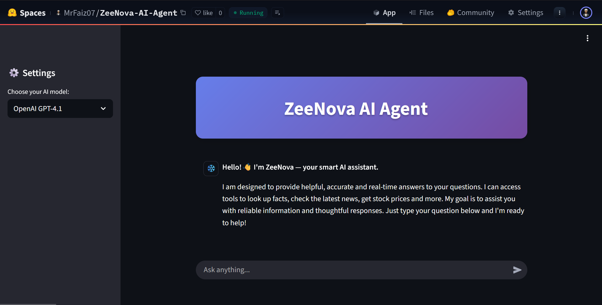

# ZeeNova AI Agent

ZeeNova is a fully autonomous, tool-augmented **AI Agent** designed to perform real-world, goal-driven tasks intelligently using LLM reasoning and dynamic tool invocation. Unlike traditional chatbots or retrieval-based assistants (RAG), ZeeNova acts as a **decision-making agent** that selects and uses the right tools to answer complex, real-time queries.

> Powered by LangChain · Integrated with 15+ Real-World Tools · Deployed with Streamlit



---

## 🔥 Why ZeeNova?

While Retrieval-Augmented Generation (RAG) systems are effective for context-rich Q&A from document sets, they often **struggle with real-time or multi-domain tasks**. ZeeNova bridges this gap by acting as a reasoning agent that:

- Chooses tools dynamically (via ReAct agent strategy)
- Interfaces with live APIs (e.g., stock, weather, currency)
- Handles conversational memory
- Performs real-time data lookup beyond LLM's training cutoff

---

## ✨ Key Features

- ✅ Tool-Augmented Reasoning (ReAct Agent)
- 🧩 Modular design (tools, models, agent logic separated)
- 🌐 Online search, live finance & weather APIs, scraping
- 🔁 Built-in memory for contextual conversation
- 📚 Clean integration with LangChain, FastAPI, and Streamlit

---

## 🛠️ Available Tools

ZeeNova includes a rich set of tools that allow the agent to answer a wide variety of **real-time, fact-based, and utility-driven queries**:

| Tool                      | Description                                                                 |
|---------------------------|-----------------------------------------------------------------------------|
| 🕒 **Time**                | Get the current time                                                       |
| 📚 **Wikipedia**           | Look up general knowledge, people, or concepts                            |
| 🔍 **Google Search**       | Search the web for news, facts, or updates                                 |
| 📈 **Stock Price Checker** | Get real-time stock prices using ticker symbols                            |
| 🌦️ **Weather**             | Check current weather conditions for any city                              |
| 💱 **Currency Converter**  | Convert between currencies in real-time                                     |
| 📺 **YouTube Search**      | Find recent videos for people, topics, or events                          |
| 🛍️ **E-commerce Search**   | Get real product listings from Amazon and Flipkart                        |
| 🇮🇳 **Indian Holiday API**  | Check if a date is a holiday or see upcoming public holidays               |
| 🚆 **Train Live Status**   | Get live running status of an Indian train                                 |
| 🧾 **PNR Checker**         | Get passenger and seat info using 10-digit PNR                             |
| ✈️ **Flight Status**       | Get live status of a flight by IATA code                                   |
| 🏦 **FD Rates Checker**    | Scrape latest fixed deposit rates from BankBazaar                         |
| 📲 **Recharge Plans**      | Get real-time prepaid mobile recharge plans (Airtel, Jio, Vi)              |

---

## 🧠 How ZeeNova is Different from RAG

| Feature                     | RAG Chatbot                           | ZeeNova AI Agent                         |
|-----------------------------|----------------------------------------|------------------------------------------|
| 🔍 **Data Source**           | Static knowledge (PDFs, Docs)          | Live external tools + APIs               |
| ⚙️ **Tool Usage**            | Not used or fixed query                | Dynamic tool selection via LLM reasoning |
| 🧩 **Flexibility**           | Narrow domain                          | General-purpose multi-domain support     |
| 🧠 **Reasoning**             | Limited to retrieved context           | Plans + reasons + acts with memory       |
| 📈 **Real-time Info**        | No                                     | Yes (stocks, flights, weather, etc.)     |

---

## 🧰 Tech Stack

| Category             | Library / Tool                     | Description                                  |
|----------------------|------------------------------------|----------------------------------------------|
| 🧠 LLM Framework      | `LangChain`                        | ReAct agent orchestration and tool routing  |
| 🖥️ Frontend           | `Streamlit`                        | Web interface for end-user interaction       |
| 🌐 Web Search         | `SerpAPI`                          | Google search tool                           |
| 📉 Finance            | `yfinance`, `BeautifulSoup`        | Stock data, FD rates                         |
| 🌦️ Weather            | `OpenWeatherMap API`               | Live weather info                            |
| 📚 Knowledge Sources  | `wikipedia`, `GoogleSearchResults` | Factual queries                              |
| ✈️ Transport          | `IRCTC RapidAPI`, `AviationStack`  | Train and flight status                      |
| 💰 Recharge Plans     | `scrapy`, unofficial telecom portals| Live prepaid offers (Airtel, Jio, Vi)        |

---

## 🚀 Getting Started

### 🔗 Option 1: Try on Hugging Face (No Setup)

Launch it instantly online:

👉 **[HuggingFace Spaces](https://huggingface.co/spaces/MrFaiz07/ZeeNova-AI-Agent)**

---

### 💻 Option 2: Run Locally

#### 1. Clone the repo

```bash
git clone https://github.com/Zeeshan-Faiz/ZeeNova-AI-Agent
cd ZeeNova-AI-Agent
```

#### 2. Create and activate a virtual environment (optional but recommended)

```bash
python -m venv venv
source venv/bin/activate  # or `venv\Scripts\activate` on Windows
```

#### 3. Install dependencies

```bash
pip install -r requirements.txt
```

#### 4. Add environment variables
Create a .env file in the root with the following keys (you can get these from respective API dashboards):

```bash
OPENAI_API_KEY=your_openai_or_github_model_token
SERPAPI_API_KEY=your_serpapi_key
RAPIDAPI_KEY=your_rapidapi_key
```

#### 5. Run the app

```bash
streamlit run streamlit_app.py
```

---

## 🧪 Example Queries You Can Try

- “What’s the current weather in Mumbai?”
- “Tell me latest stock price of Tesla”
- “Search YouTube for Cristiano Ronaldo’s latest video”
- “Check Indian Railways live status for train 12951”
- “What are the current recharge plans for Airtel prepaid?”
- “Convert 100 USD to INR”
- “Is 15th August a public holiday in India?”

---

## 🛠️ Project Structure

```
ZeeNova-AI-Agent/
├── 📁 agent/                    # Agent setup using LangChain ReAct
│   └── agent_setup.py
├── 📁 tools/                    # All tool logic and registry
│   ├── tool_functions.py       # Actual logic of tool functions
│   └── tool_registry.py        # Registers tools using LangChain's Tool class
├── 📁 models/                   # Model enum and wrapper
│   └── model_enum.py
├── 📁 api/                      # FastAPI backend for chat and routing
│   └── main.py
├── main.py                      # Entry point for Streamlit-based UI
├── .env                         # Environment file for API keys
├── requirements.txt             # Python package dependencies
└── README.md                    # Project documentation
```
---
